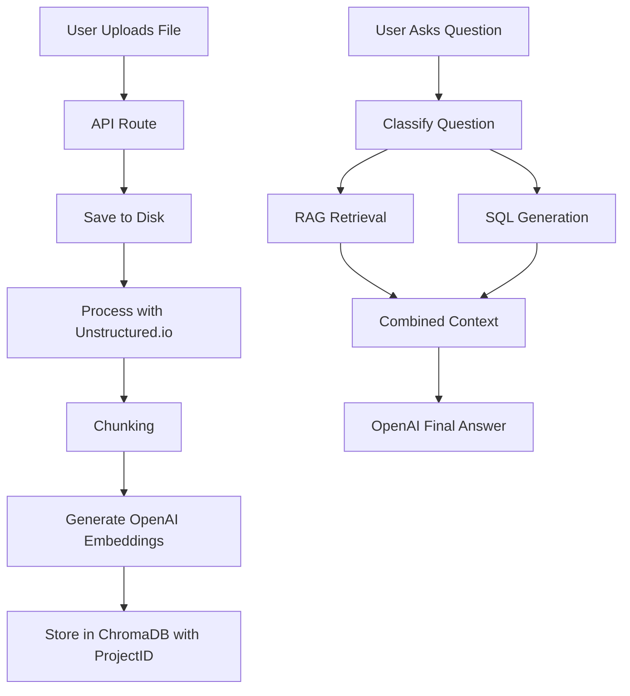

# Implementation Plan - Project-based RAG System

This plan outlines the steps to implement a project-based RAG (Retrieval-Augmented Generation) system within the Research Intelligence Platform.

## 1. Dependencies & Environment
- Install `unstructured-client`.
- Configure `.env.local` with:
  - `OPENAI_API_KEY`
  - `UNSTRUCTURED_API_KEY`
  - `UNSTRUCTURED_API_URL`

## 2. Backend Implementation
### A. File Upload API (`app/api/upload/route.ts`)
- Handle multipart form data.
- Validate PDF, DOCX, CSV.
- Save to `uploads/`.
- Return file metadata.

### B. Document Processing (`lib/rag/processDocument.ts`)
- Integrate with Unstructured.io API.
- Implement chunking strategy.
- Return structured chunks.

### C. Embedding & Vector Store (`lib/rag/embed.ts`)
- Initialize `OpenAIEmbeddings` (text-embedding-3-small).
- Setup `Chroma` vector store.
- Implement `embedAndStore(projectId, chunks)` function.

### D. Retrieval (`lib/rag/retrieve.ts`)
- Implement `retrieveContext(projectId, query)` function.
- Filter by `projectId` in ChromaDB.

### E. Unified AI Route (`app/api/ask/route.ts`)
- Add logic to classify the user query.
- Route to SQL generation, RAG retrieval, or both.
- Combine contexts for the final prompt.

## 3. Frontend Implementation
### A. Upload Component (`components/UploadZone.tsx`)
- Beautiful drag-and-drop zone using Tailwind CSS.
- Progress bar and file list.

### B. Project Page (`app/project/[id]/page.tsx`)
- Display project metadata.
- List uploaded files.
- Integrated AI Chat interface.

## 4. RAG Architecture

